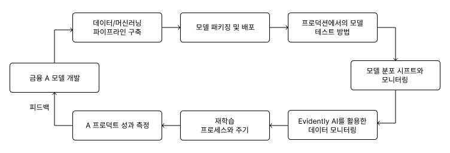

# CHAPTER 5 금융 AI 프로덕트 관리

#### AI 프로덕트(AI Product)

인공지능(AI) 기술을 핵심 가치나 주요 기능으로 삼아, 사용자의 특정 문제를 해결하고 가치를 제공하는 제품(소프트웨어, 서비스, 하드웨어)

#### 금융 AI 프로덕트 개발에 필요한 것들

---

## 5.1 데이터 파이프라인 구축

AI 시스템에서 데이터를 수집·가공·활용하기 위한 과정

#### 목적

- 데이터 분석 지원
- 운영 모델 지원

#### 처리 방식

| 방식          | 설명                           | 예시                          |
| ------------- | ------------------------------ | ----------------------------- |
| 배치 처리     | 일정 주기로 데이터를 일괄 처리 | 매일 새벽 데이터 수집 및 처리 |
| 스트리밍 처리 | 데이터를 실시간 처리           | 실시간 금융 사기 탐지         |

#### 구성요소

- 데이터 수집
- 정제 및 전처리
- 모델 학습 및 예측
- 데이터 마트 생성

---

## 5.2 데이터 파이프라인 예시

- 데이터를 수집·가공하여 DWH와 DM 구축에 활용

#### DWH(Data Warehouse, 데이터 웨어하우스)

- 기업 전체 데이터를 통합 저장하는 저장소

#### DM(Data Mart, 데이터 마트)

- 특정 목적이나 부서에 맞게 구성한 데이터 저장소

---

## 5.3 SQL과 Airflow를 활용한 배치 처리

#### SQL

- 데이터 조회·추출·가공 언어

#### Airflow

- 데이터 파이프라인 자동화 및 스케줄링 도구

---

## 5.4 모델 패키징 및 배포

### 5.4.1 모델 패키징

- 학습된 모델을 서비스 가능한 형태로 변환하는 과정

| 도구        | 설명                      |
| ----------- | ------------------------- |
| ONNX        | 모델 표준 형식            |
| PMML        | 모델 저장용 XML 표준      |
| SavedModel  | TensorFlow 모델 저장 형식 |
| TorchScript | PyTorch 모델 배포 형식    |
| Docker      | 실행 환경 포함 패키징     |

---

### 5.4.2 모델 배포

| 방법          | 설명                |
| ------------- | ------------------- |
| 웹 서비스     | REST API 제공       |
| 클라우드      | 클라우드 환경 배포  |
| 온프레미스    | 자체 서버 운영      |
| 엣지 디바이스 | 모바일·IoT 배포     |
| 모델 서버     | 모델 추론 전용 서버 |

#### 대표 서비스

- 클라우드: AWS SageMaker, Google Cloud AI Platform
- 모델 서버: TensorFlow Serving, NVIDIA Triton

---

## 5.5 프로덕션 환경에서의 모델 테스트

- 신규 모델을 점진적으로 배포하며 성능 검증

#### 대표적인 배포 전략

| 방식           | 설명                                  |
| -------------- | ------------------------------------- |
| 블루/그린 배포 | 새 버전을 별도 환경에 배포 후 전환    |
| 섀도 배포      | 실제 트래픽을 복제해 새 모델만 테스트 |
| 카나리 배포    | 일부 사용자에게만 먼저 배포 후 확대   |

---

## 5.6 AI 프로덕트 성능 모니터링

- 데이터 변화와 모델 성능을 지속적으로 관찰하는 과정

#### 용어 정리: 데이터 분포 시프트

- 시프트(Shift): 변화, 이동
- 모델 학습에 사용된 데이터 분포와 실제 운영 환경의 데이터 분포가 달라지는 현상

---

### 5.6.1 공변량 시프트

- 모델 **입력 데이터의 분포가 변하는 현상**
- 입력 데이터는 변하지만 입력-출력 관계는 유지
- 예: 신용평가 모델 학습 당시 고객 평균 연령이 40대였는데, 현재는 20~30대 고객 비중이 증가한 경우

---

### 5.6.2 개념 드리프트

- 입력 데이터 분포는 비슷하지만 **입력-출력 관계가 변하는 현상**
- 사회·경제·계절적 변화 등으로 발생
- 예: 과거에는 소득이 높은 고객이 대출금을 잘 상환했지만, 경기 침체 이후에는 소득이 높아도 상환하지 못하는 경우가 늘어난 경우

---

### 5.6.3 모델 성능 저하를 불러오는 변화 유형

- 피처 변화: 입력 데이터의 특성이 변하는 현상
- 레이블 스키마 변화: 출력값의 기준이나 범위가 변하는 현상

---

### 5.6.4 데이터 분포 시프트를 감지하는 방법

- 지표: PSI, KLD, KS-Test
- 도구: Alibi Detect, Amazon SageMaker Model Monitor

---

## 5.7 AI 프로덕트의 모델 재학습 주기

#### 재학습 프로세스

1. 성능 모니터링
2. 재학습 주기 결정
3. 재학습 임계치 설정
4. 테스트 및 재학습
5. 자동화

#### 재학습 주기 예시

| 모델                | 주기      | 주기 설정 이유                               |
| ------------------- | --------- | -------------------------------------------- |
| 신용 평가 모델      | 6개월~1년 | 경제 상황, 법률 변경, 금리 변경 등 외부 요인 |
| 금융 사기 탐지 모델 | 1주~1개월 | 사기 패턴의 지속적인 변화에 대응             |
| 퀀트 투자 모델      | 1주~1개월 | 시장 변동성이 높은 데이터                    |

---

## 5.8 AI 프로덕트 성과 및 가치 측정

### 5.8.1 비즈니스 관점

- 효율성 증가
- 의사결정 품질 개선
- 새로운 비즈니스 기회 탐색
- 규제 준수

---

### 5.8.2 시스템적 관점

- 신뢰성
- 확장성
- 유지보수성
- 적응성

---

### 5.8.3 체계적이고 정량적인 지표를 제공하자

- 데이터 접근성
- 상호 운용성
- 분석 가능성
- 사용자 가치

→ 각 항목을 점수화하여 프로덕트의 강점과 개선점 파악
