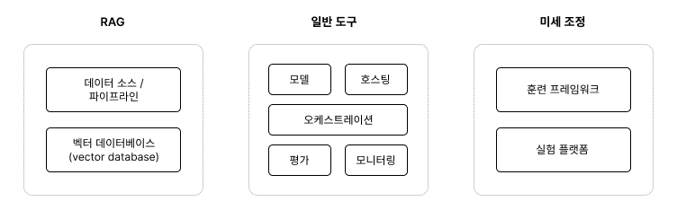

# CHAPTER 6 금융에서의 생성형 AI 활용

#### 생성형 AI

- 주어진 데이터를 기반으로 새로운 콘텐츠를 생성하는 AI
- 텍스트, 코드, 이미지 등 다양한 결과물 생성 가능

#### LLM (Large Language Model)

- 대규모 텍스트 데이터를 학습한 생성형 AI 모델
- 사람처럼 자연스러운 언어를 이해하고 생성
- 예: ChatGPT
- 특징: 모델 규모가 커질수록 성능이 향상되는 스케일 법칙 존재

#### LLM 기반 생성형 AI의 동작 과정

1. 입력 처리
2. 관련 정보 검색
3. 응답 생성

#### LLM 활용 방식

- **파운데이션 모델 활용**: 사전 학습된 대규모 AI 모델을 다양한 업무에 활용
- **프롬프트 엔지니어링**: 원하는 결과를 얻기 위해 입력 문장을 효과적으로 설계하는 기법
- **RAG**: 외부 문서나 데이터를 검색하여 LLM의 응답 정확도를 높이는 기법

---

## 6.1 RAG의 동작 과정

### 6.1.1 데이터 수집 및 변환

- 데이터 레이크, 데이터 웨어하우스 등에 저장된 문서를 수집
- 문서를 검색 가능한 형태로 가공

---

### 6.1.2 임베딩

- 문서의 의미를 벡터(Vector) 형태로 변환하는 과정
- 의미가 유사한 문서일수록 벡터 공간에서 가까이 위치

---

### 6.1.3 질의와 문서 임베딩 비교

- 사용자 질의를 임베딩으로 변환
- 문서 임베딩과 비교하여 관련성이 높은 문서 검색

---

### 6.1.4 프롬프트 보강

- 검색된 문서 정보를 사용자 질의와 함께 프롬프트에 추가
- 보강된 프롬프트를 LLM에 전달하여 응답 생성

---

## 6.2 LLM 애플리케이션을 만들기 위한 도구들

### 6.2.1 RAG

| 구성 요소              | 설명             |
| ---------------------- | ---------------- |
| 데이터 소스·파이프라인 | 데이터 수집·처리 |
| 벡터 데이터베이스      | 문서 유사도 검색 |

---

### 6.2.2 공통 도구

| 도구           | 설명                              |
| -------------- | --------------------------------- |
| 모델           | LLM 제공 모델 (OpenAI 등)         |
| 호스팅         | 애플리케이션 배포 및 운영         |
| 오케스트레이션 | LLM 관련 작업 흐름 관리 및 자동화 |
| 평가           | 모델의 품질과 성능 평가           |
| 모니터링       | 모델 성능 및 사용자 상호작용 추적 |

---

### 6.2.3 미세 조정

- 특정 업무에 맞게 모델을 추가 학습시키는 과정

| 도구            | 설명                                     |
| --------------- | ---------------------------------------- |
| 훈련 프레임워크 | 모델 학습을 위한 도구 및 클라우드 서비스 |
| 실험 관리       | 학습 과정 및 결과 분석                   |

---

## 6.3 금융에서의 생성형 AI 활용 방안

### 생산성 향상

- 백오피스·미들오피스 업무 자동화 및 최적화
- 규제 준수 및 보고
- 데이터 분석
- 거래 손익 정산
- 리스크 관리
- 사기 탐지 및 방지
- AML/CTF

### 가치 창출

- 프론트오피스 업무 혁신 및 고객 경험 향상
- 신제품 개발
- 타깃 마케팅 및 세일즈
- 고객 온보딩·인증
- 거래 전략 수립 및 실행

<aside>

    AML/CTF
    - 자금세탁방지(Anti-Money Laundering) 및 테러자금조달방지(Counter Terrorism Financing)
    - 범죄 수익을 합법화하는 자금세탁과 테러 단체로의 자금 유입을 차단하기 위한 국제 규제 체계

    고객 온보딩
    - 신규 고객이 서비스에 적응하고 가치를 경험하도록 지원하는 과정

</aside>

---

## 6.4 생성형 AI에 대한 오해와 진실

### 6.4.1 생성형 AI 기술은 새롭다

- 아니다. 기존 AI 기술의 발전과 결합을 통해 발전한 기술이다.

---

### 6.4.2 기반 모델이 기존의 머신러닝을 완전히 대체할 것이다

- 아니다. 생성형 AI와 기존 머신러닝은 상호 보완 관계이다.
- 상황에 따라 함께 활용하는 것이 효과적이다.

---

### 6.4.3 환각 현상 때문에 생성형 AI 응용이 불가능하다

- 아니다. 환각 현상은 충분히 관리 가능한 문제이다.
- 환각 현상: 사실이 아닌 정보를 그럴듯하게 생성하는 현상
- RAG, 웹 검색 등을 통해 완화할 수 있다.

---

### 6.4.4 생성형 AI가 모든 문제를 해결할 것이다

- 아니다. 생성형 AI는 데이터 품질과 양에 크게 영향을 받는다.
- 기존 기술과의 적절한 조화가 필요하다.

---

## 6.5 마무리

- 금융 산업에서 생성형 AI 활용은 빠르게 확대되고 있음
- 금융 기업은 새로운 기술을 신중하게 도입해야 함
- 혁신과 신뢰성·안정성 사이의 균형이 중요함
